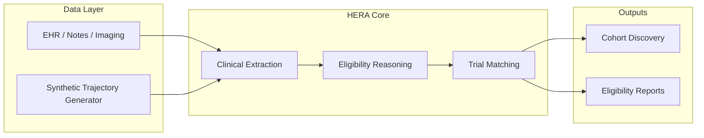

# HERA — Healthcare Eligibility & Reasoning Agent

HERA is an agentic workflow that automates extraction and synthesis of unstructured clinical text to match patients with active cardiovascular, ICU, and oncology clinical trials.

Traditional cohort discovery and trial matching rely on manual, time-consuming chart reviews of complex EHR data, clinician notes, and imaging reports. HERA replaces much of that manual work with structured reasoning over longitudinal patient trajectories.

## Problem

Clinical trial matching requires:

- Parsing heterogeneous EHR fields, progress notes, and diagnostic reports
- Tracking longitudinal changes in vitals, labs, medications, and diagnoses
- Evaluating inclusion/exclusion criteria against evolving patient states

HERA targets this gap with synthetic and real patient trajectories, structured schemas, and LLM-assisted reasoning pipelines.

## Architecture



### Specialty coverage

Synthetic and real-world cohorts emphasize three domains:

| Specialty | Target share | Example scenarios |
|-----------|--------------|-------------------|
| Cardiovascular | 50% | HFrEF titration, acute MI, post-PCI management |
| Oncology | 35% | Chemotherapy cardiotoxicity, advanced solid tumors |
| ICU / Critical Care | 15% | Septic shock, cardiogenic shock, post-CABG recovery |

## Project structure

```
HERA/
├── README.md
├── requirements.txt
├── .env                          # API keys and runtime config (not committed)
└── structured_clinical_data/     # Synthetic dataset generation engine
    ├── conditions.py             # Clinical scenario library by specialty
    ├── schemas.py                # Pydantic models (PatientTrajectory, Encounter, …)
    ├── engine.py                 # Task planning, batch I/O, parsing
    ├── generate.py               # CLI entry point
    └── output/                   # Generated batch inputs and datasets (gitignored)
├── soap_notes/                   # Structured → SOAP note conversion
    ├── engine.py                 # convert_structured_to_soap + batch pipeline
    ├── generate.py               # CLI entry point
    └── output/
└── db_script/
    ├── schema.sql                # Supabase table definition
    └── push_notes.py             # Load SOAP JSON into Supabase
```

## Getting started

### 1. Install dependencies

```bash
python -m venv .venv
.venv\Scripts\activate        # Windows
pip install -r requirements.txt
```

### 2. Configure environment

Create or update `.env` in the project root:

```env
OPENAI_API_KEY=your_key_here
MODEL_NAME=gpt-4o-mini
DATASET_TARGET_COUNT=5000
DATASET_OUTPUT_DIR=structured_clinical_data/output
```

`gpt-4o-mini` is the default for cost-efficient batch generation. The [OpenAI Batch API](https://developers.openai.com/api/docs/guides/batch) runs asynchronously with **50% lower cost** than synchronous requests and separate rate limits.

### 3. Generate synthetic trajectories

**Preview the plan and write batch input (no API spend):**

```bash
python -m structured_clinical_data.generate --count 5000 --dry-run
```

**Submit a batch job:**

```bash
python -m structured_clinical_data.generate --count 5000 --submit
```

**Submit and wait until completion:**

```bash
python -m structured_clinical_data.generate --count 5000 --submit --wait
```

**Collect results from an existing batch:**

```bash
python -m structured_clinical_data.generate --batch-id batch_abc123 --wait
```

Each run creates a timestamped folder under `structured_clinical_data/output/` containing:

- `batches/batch_input.jsonl` — OpenAI Batch request file
- `batches/{batch_id}_manifest.json` — job metadata
- `datasets/patient_trajectories.json` — validated records in one JSON file
- `datasets/parse_failures.json` — validation failures (if any)

## Synthetic data engine

The generator in `structured_clinical_data/` is a small pipeline:

1. **Task planner** (`engine.plan_tasks`) — Allocates records across specialties (50% / 35% / 15%) and picks a random scenario from `conditions.py`.
2. **Batch input** (`engine.write_batch_input`) — Writes one OpenAI Batch request per patient with the system prompt and strict JSON schema.
3. **Batch runner** — Uploads the JSONL, polls status, and downloads results per OpenAI batch guidelines.
4. **Parser** — Validates each response with `PatientTrajectory` and writes the final dataset.

### Data schema

Each record is a longitudinal `PatientTrajectory`:

- Demographics and trial-relevant inclusion/exclusion summary
- 2–4 chronologically ordered `Encounter` objects with vitals, labs, medications, procedures, diagnoses, and search tags
- Physiological coherence enforced via prompt rules and Pydantic validation

See `structured_clinical_data/schemas.py` for the canonical schema.

## SOAP progress notes

Convert structured trajectories into unstructured EHR-style SOAP notes.

Each patient timeline entry becomes one note. The converter passes the **current encounter** plus **all prior encounters** so the LLM can write realistic clinical continuity (e.g. "status post PCI on day 3").

**Single note (sync API):**

```python
from soap_notes import convert_structured_to_soap

note = convert_structured_to_soap(patient_profile, target_encounter_idx=1)
```

**Batch conversion (recommended at scale):**

```bash
python -m soap_notes.generate \
  --input structured_clinical_data/output/<run>/datasets/patient_trajectories.json \
  --submit --wait
```

Output: `soap_notes/output/<run>/datasets/soap_progress_notes.json`

```json
{
  "count": 12000,
  "notes": [
    {
      "patient_id": "PT-000001",
      "encounter_id": "ENC-001",
      "encounter_index": 0,
      "encounter_type": "First Presentation",
      "specialty_key": "cardiovascular_care",
      "specialty_label": "Cardiovascular",
      "scenario_brief": "...",
      "soap_note": "SUBJECTIVE:\n..."
    }
  ]
}
```

The payload sent to the model includes a slice of `CLINICAL_CONDITION` from `conditions.py` for specialty context.

## Supabase upload

1. Run `db_script/schema.sql` in the Supabase SQL editor.
2. Set remote credentials in `.env`:

```env
SUPABASE_URL=https://your-project.supabase.co
SUPABASE_SERVICE_KEY=your_service_role_key
SUPABASE_NOTES_TABLE=clinical_progress_notes
```

3. Push the aggregated SOAP JSON:

```bash
python -m db_script.push_notes \
  --input soap_notes/output/<run>/datasets/soap_progress_notes.json
```

Rows are upserted on `(patient_id, encounter_index)` by default. Pass `--insert` for insert-only.

## Environment variables

| Variable | Description | Default |
|----------|-------------|---------|
| `OPENAI_API_KEY` | OpenAI API key | Required |
| `MODEL_NAME` | Chat model for batch requests | `gpt-4o-mini` |
| `DATASET_TARGET_COUNT` | Default `--count` when omitted | `5000` |
| `DATASET_OUTPUT_DIR` | Output root for batch artifacts | `structured_clinical_data/output` |
| `SOAP_OUTPUT_DIR` | Output root for SOAP batch runs | `soap_notes/output` |
| `SUPABASE_URL` | Supabase project URL | Required for db push |
| `SUPABASE_SERVICE_KEY` | Service role key for writes | Required for db push |
| `SUPABASE_NOTES_TABLE` | Target table name | `clinical_progress_notes` |

## Cost and scale notes

- **Batch API** is recommended for 5k–10k records: lower cost, higher throughput, 24-hour completion window.
- One batch request = one patient trajectory, keeping context size small and validation straightforward.
- OpenAI allows up to **50,000 requests per batch** and **200 MB** input files.
- Use `--dry-run` to inspect specialty distribution and JSONL format before spending credits.

## Disclaimer

Synthetic records produced by HERA are for **research, development, and evaluation only**. They must not be used as real patient data or for clinical decision-making.

## License

Add your license here.
